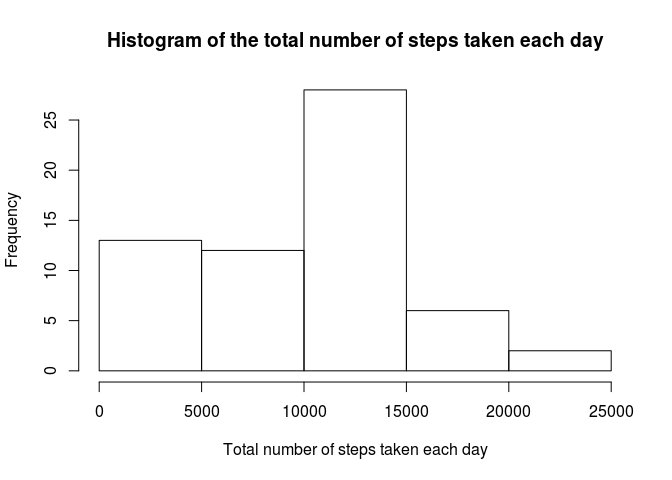
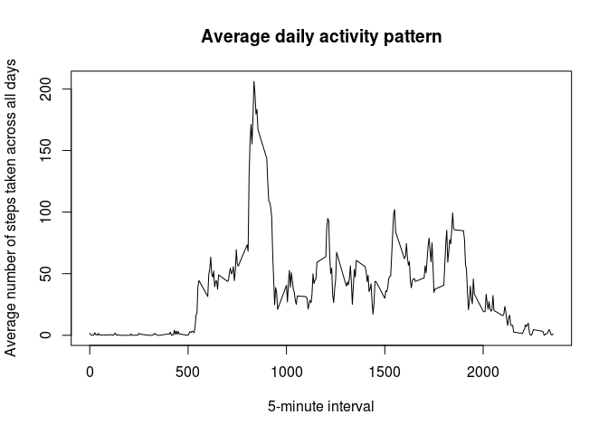
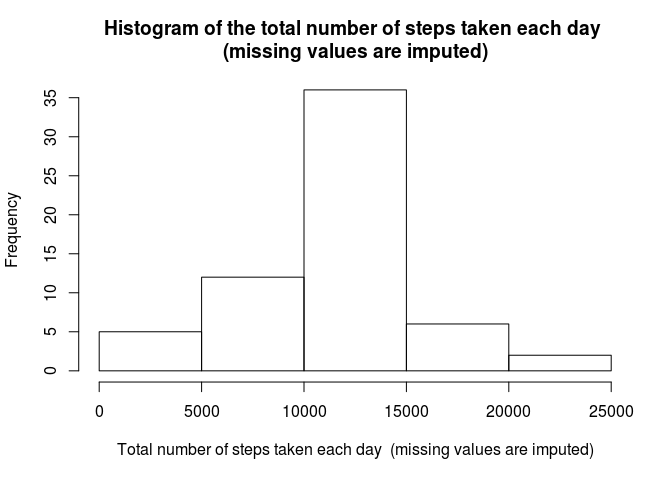
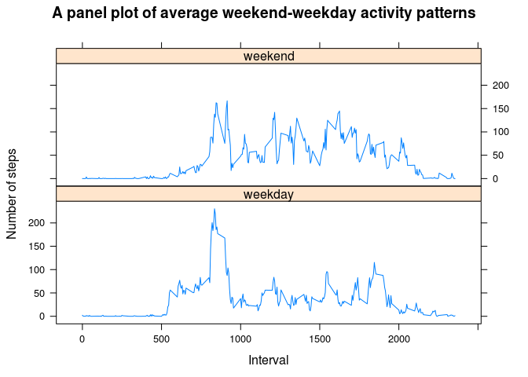

# Coursera, Data Science - Reproducible Research: Course Project 1


## Introduction

It is now possible to collect a large amount of data about personal movement using activity monitoring devices such as a [Fitbit](http://www.fitbit.com/), [Nike Fuelband](http://www.nike.com/us/en_us/c/nikeplus-fuelband), or [Jawbone Up](https://jawbone.com/up). These type of devices are part of the “quantified self” movement – a group of enthusiasts who take measurements about themselves regularly to improve their health, to find patterns in their behavior, or because they are tech geeks. But these data remain under-utilized both because the raw data are hard to obtain and there is a lack of statistical methods and software for processing and interpreting the data.

This assignment makes use of data from a personal activity monitoring device. This device collects data at 5 minute intervals through out the day. The data consists of two months of data from an anonymous individual collected during the months of October and November, 2012 and include the number of steps taken in 5 minute intervals each day.


## Data

The data for this assignment can be downloaded from the course web site:

* Dataset: [Activity monitoring data](https://d396qusza40orc.cloudfront.net/repdata%2Fdata%2Factivity.zip) [52K]

The variables included in this dataset are:

* steps: Number of steps taking in a 5-minute interval (missing values are coded as NA)
* date: The date on which the measurement was taken in YYYY-MM-DD format
* interval: Identifier for the 5-minute interval in which measurement was taken

The dataset is stored in a comma-separated-value (CSV) file and there are a total of 17,568 observations in this dataset.


## Loading and preprocessing the data

Load the dataset, 'date' column as 'Date' class, and attach 'dplyr' package to process the dataset.


```r
zipFile <- "activity.zip"
fileList <- unzip(zipFile, list = TRUE)
dataSet <- read.csv(unz(zipFile, fileList$Name[1]),
                    colClasses = c(date = "Date"))
library("dplyr")
```


## What is mean total number of steps taken per day?

Calculate the total number of steps taken each day, and make a histogram of them, ignoring the missing values in the dataset.


```r
dataSetGrp <- group_by(dataSet, date)
dataSetGrpSum <- summarise_each(dataSetGrp, funs(sum(., na.rm = TRUE)), steps)
hist(dataSetGrpSum$steps,
     main = "Histogram of the total number of steps taken each day",
     xlab = "Total number of steps taken each day")
```

\

Calculate the mean and median number of steps taken each day.


```r
meanStepsEachDay <- mean(dataSetGrpSum$steps)
medianStepsEachDay <- median(dataSetGrpSum$steps)
```

The mean and median number of steps taken each day are, non-integral numeric values are truncated towards zero,

* The mean: 9354
* The median: 10395.


## What is the average daily activity pattern?

Make a time series plot of the average daily activiy pattern by calculating and plotting the average number of steps taken across all days as y-axis and 5-minute interval as x-axis, ignoring the missing values in the dataset.


```r
dataSetGrp <- group_by(dataSet, interval)
dataSetGrpAvg <- summarise_each(dataSetGrp, funs(mean(., na.rm = TRUE)), steps)
plot(dataSetGrpAvg$interval, dataSetGrpAvg$steps, type = "l",
     main = "Average daily activity pattern",
     xlab = "5-minute interval",
     ylab = "Average number of steps taken across all days")
```

\

Calculate the 5-minute interval, on average across all the days in the dataset, which contains the maximum number of steps.


```r
maxStepInterval <- dataSetGrpAvg$interval[which.max(dataSetGrpAvg$steps)]
```

The 5-minute interval that, on average, contains the maximum number of steps is 835.


## Imputing missing values

There are a number of days/intervals where there are missing values (coded as NA). The presence of missing days may introduce bias into some calculations or summaries of the data.

Calculate the total number of missing values in the dataset (i.e. the total number of rows with NAs).


```r
isNA <- is.na(dataSet$steps)
numOfNA <- sum(isNA)
```

The total number of missing values of steps in the dataset is 2304.

The strategy for filling in all of the missing values of steps in the dataset is to use the average number of steps taken across all days for that 5-minute interval.

Create a new dataset that is equal to the original dataset but with the missing values of steps filled in by the strategy.


```r
dataSetNew <- dataSet
stepsIntervalRep <- rep(dataSetGrpAvg$steps, 61)
for(i in 1:length(dataSetNew$steps)) {
        if(isNA[i]) dataSetNew$steps[i] <- stepsIntervalRep[i]
}
```

Make a histogram of the total number of steps taken each day after missing values are imputed.


```r
dataSetNewGrp <- group_by(dataSetNew, date)
dataSetNewGrpSum <- summarise_each(dataSetNewGrp, funs(sum), steps)
hist(dataSetNewGrpSum$steps,
     main = paste("Histogram of the total number of steps taken each day",
                  "\n(missing values are imputed)"),
     xlab = paste("Total number of steps taken each day",
                  " (missing values are imputed)"))
```

\

Calculate the mean and median number of steps taken each day after missing values are imputed.


```r
meanStepsEachDayNew <-mean(dataSetNewGrpSum$steps)
medianStepsEachDayNew <- median(dataSetNewGrpSum$steps)
```

The mean and median number of steps taken each day after missing values are imputed are, non-integral numeric values are truncated towards zero,

* The Mean(imput): 10766
* The Median(imput): 10766.

As shown, the mean and median values after missing values are imputed by the strategy differ from the estimates of the first part. The impact of imputing missing values is to make the mean and median values as same which were different.


## Are there differences in activity patterns between weekdays and weekends?

Create a new factor variable in the dataset with two levels – “weekday” and “weekend” indicating whether a given date is a weekday or weekend day, using the dataset with the filled-in missing values. To make the output of 'weekdays()' function as English, set the locale for the R process to US English 'en_US.UTF-8'.


```r
Sys.setlocale("LC_ALL", 'en_US.UTF-8')
```


```r
weekDays <- weekdays(dataSetNew$date)
for(i in 1:length(weekDays)) {
        if(weekDays[i] == "Saturday" || weekDays[i] == "Sunday") {
                weekDays[i] <- "weekend"
        } else {
                weekDays[i] <- "weekday"
        }
}
dataSetNew <- cbind(dataSetNew, weekdays = factor(weekDays))
```

Make a panel plot containing a time series plot of the 5-minute interval (x-axis) and the average number of steps taken, averaged across all weekday days or weekend days (y-axis), using 'lattice' package 'xyplot()' function.


```r
library("lattice")
```


```r
dataSetNewGrp <- group_by(dataSetNew, weekdays, interval)
dataSetNewGrpAvg <- summarise_each(dataSetNewGrp, funs(mean), steps)
xyplot(steps ~ interval | weekdays, data = dataSetNewGrpAvg,
       layout = c(1,2), type='l',
       main = "A panel plot of average weekend-weekday activity patterns",
       xlab = "Interval", ylab= "Number of steps")
```

\

As shown, the weekend and weekday activity patterns are slightly differenet in some 5-minute time intervals and they are roughly similar.
